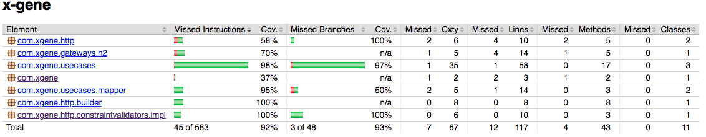

# x-gene

API para encontrar genes mutantes em uma matrix de DNA
URL da aplicação no heroku
```
https://floating-sierra-54525.herokuapp.com
```

## Getting Started

Para executar o projeto local execute os comandos:
Criar imagem docker
```
  make build
```
Criar o container e subir a aplicação
```
  make run
```

A aplicação ficará exposta na porta 8081.

Duas API ficam expostas.

Validar se DNA é mutante.
Retorno status 204 para sucesso sem message-body
Retorno status 403 para o caso de não encontrar DNA mutante.
Retorno status 400 para request não valida (Cadeia de DNA diferente de ATCGatcg ou body sem DNA)
```
/mutant
POST body { "dna":["ATGCGA","CTGTGC","TTATTT","AGAGGG","CGCCTA","TCACTG"]  }
```

Estatisticas da base de dados.
Retorno status 200 para sucesso com body ``` {
                                                 "count_mutant_dna": 0,
                                                 "count_human_dna": 0,
                                                 "ratio": "0.0"
                                             } ```
```
/stats
GET
```
### Prerequisites

Docker
Java 8
Maven

## Running the tests

```
mvn test
```

### And coding style tests

Testes unitários na camada de negócio e conecxão com banco de dados.
89% de cobertura desconsiderando classes de domain, json e exception.



## Authors

* **Bruno Rodrigues**
